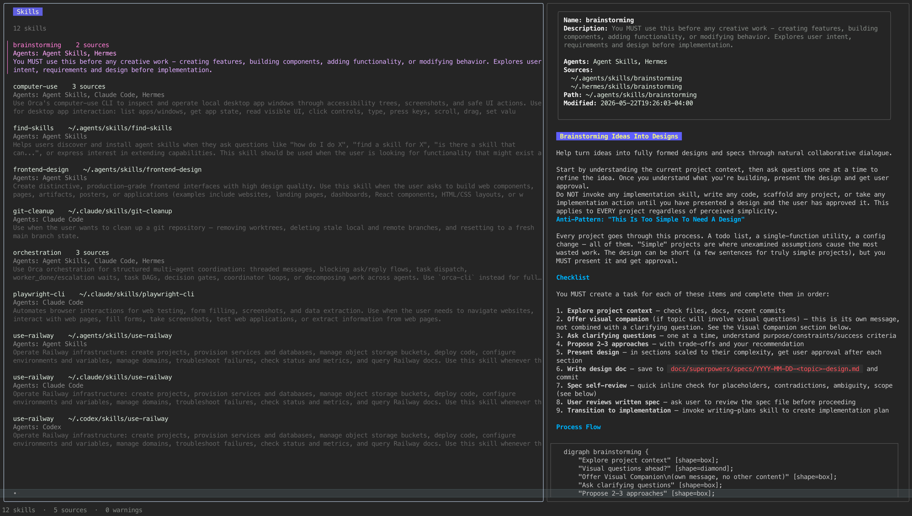

# skillbrowse

A read-only, keyboard-first terminal application (macOS and Linux) for discovering and reading AI-agent skills (`SKILL.md` files) installed across tools like Claude Code, Cursor, Codex, Hermes, and generic `~/.agents` layouts.

> Run one command, see every locally installed skill, and read its instructions immediately.



## Status

Implementation is in progress, following the phased plan in [`docs/skillbrowse-implementation-plan.md`](docs/skillbrowse-implementation-plan.md). Phases 0–6 (scaffolding through the release pipeline) are complete; track detailed progress and current caveats in [`tasks/todo.md`](tasks/todo.md).

## Installing

```sh
curl -fsSL https://raw.githubusercontent.com/dchancogne/skillbrowse/main/install.sh | sh
```

This downloads the right archive for your OS/architecture from the latest [GitHub Release](https://github.com/dchancogne/skillbrowse/releases), verifies its SHA-256 checksum, and installs `skillbrowse` to `~/.local/bin` (override with `SKILLBROWSE_INSTALL_DIR`).

Alternatively, download an archive directly from the [Releases page](https://github.com/dchancogne/skillbrowse/releases) and verify it yourself — see "Verifying releases" below — or build from source:

```sh
go install github.com/dchancogne/skillbrowse/cmd/skillbrowse@latest
```

### Verifying releases

Every release publishes `checksums.txt` alongside a detached Ed25519 signature (`checksums.txt.sig`) and per-archive SBOMs. `skillbrowse`'s own `upgrade` command verifies both automatically. To verify a manually downloaded archive yourself:

```sh
# 1. Checksum (portable — sha256sum on Linux, shasum -a 256 on macOS)
grep " skillbrowse_<os>_<arch>.tar.gz\$" checksums.txt | shasum -a 256 -c -

# 2. Signature (requires OpenSSL 3+; this is the same public key
#    embedded in internal/update/verify.go)
PUBHEX="b9991b8853a2b28d346199513d55850261eaa9667a66d1b53b154ac80eed5f3f"
echo -n "302a300506032b6570032100${PUBHEX}" | xxd -r -p | \
  openssl pkey -pubin -inform DER -outform PEM -out skillbrowse.pub.pem
openssl pkeyutl -verify -rawin -in checksums.txt -sigfile checksums.txt.sig \
  -pubin -inkey skillbrowse.pub.pem
```

(The install script only performs the checksum check — see its header comment for why signature verification isn't practical to bootstrap in a shell script. Every subsequent `skillbrowse upgrade` performs full Ed25519 verification in Go.)

## Usage

Running `skillbrowse` opens the interactive catalog browser:

| Key | Action |
|---|---|
| `↑/k`, `↓/j` | Move selection |
| `/` | Fuzzy search |
| `enter` | Focus/open details |
| `esc` | Clear search / return to catalog |
| `v` | Toggle rendered/raw Markdown |
| `r` | Rescan sources |
| `u` | Check for a `skillbrowse` update (with confirmation before installing) |
| `?` | Toggle help and diagnostics |
| `q`, `ctrl+c` | Quit |

```text
skillbrowse [--config PATH] [--path PATH ...] [--no-defaults] [--no-color]
skillbrowse upgrade [--check] [--yes]
skillbrowse version
skillbrowse help
```

Set `SKILLBROWSE_DEBUG=1` to enable structured diagnostic logging on stderr (useful when reporting an issue). Set `--no-color` or the standard `NO_COLOR` environment variable to disable ANSI styling entirely.

## Configuration

`skillbrowse` scans a built-in registry of well-known skill directories by default (see [`internal/sources`](internal/sources)). Add custom sources via `$XDG_CONFIG_HOME/skillbrowse/config.toml` (or `~/.config/skillbrowse/config.toml`):

```toml
version = 1

[[sources]]
path = "~/work/shared-agent-skills"
label = "Team skills"
agents = ["Claude Code", "Codex"]
max_depth = 4
enabled = true
```

`label`, `agents`, `max_depth` (1–12, default 4), and `enabled` are all optional. Relative paths are rejected; `~` is only accepted as the first path component. Use `--no-defaults` to scan only configured/`--path` sources, or repeat `--path` to add unlabeled sources for a single run.

## Diagnostics and privacy

- Scanning and rendering are entirely local; ordinary browsing makes zero network requests. Network access happens only for explicit `u`/`upgrade` actions.
- A malformed skill, an unreadable directory, or a missing built-in source never aborts the rest of the scan — problems surface as a warning count in the footer and in detail under the help overlay (`?`) or a skill's own detail pane.
- Diagnostics never include file content, and default error output never includes stack traces. `SKILLBROWSE_DEBUG=1` adds structured detail on stderr for development, still without ever including skill content.

## Upgrading

`skillbrowse upgrade` (or `u` inside the TUI) checks for a newer release, shows the current/target version and release URL, and asks for confirmation before installing — unless `--yes` (CLI) or `y` (TUI) is given. The updater downloads to bounded temporary files, verifies the release's checksum and Ed25519 signature, safely extracts just the executable, confirms the staged binary reports the expected version, and only then atomically replaces the running binary. Any failure before that final step leaves your current installation untouched.

## Uninstalling

Remove the binary from wherever `install.sh` put it (`~/.local/bin/skillbrowse` by default, or `$SKILLBROWSE_INSTALL_DIR`) and, if you created one, your config file at `~/.config/skillbrowse/config.toml`. `skillbrowse` never writes anywhere else — no daemon, cache, or database to clean up.

## Key design constraints

- **Read-only in v1** — never installs, edits, deletes, or upgrades skills themselves; only the `skillbrowse` binary self-upgrades.
- **No network on ordinary startup/browsing/rescan** — network access is explicit and user-initiated (`u` / `upgrade` command) only.
- **Resilience** — a malformed skill or unreadable source never aborts scanning of the rest.
- **Untrusted content** — `SKILL.md` files are treated as untrusted text: never executed or templated, and terminal control sequences are sanitized before rendering.

## Documentation

- [`docs/skillbrowse-project-brief.md`](docs/skillbrowse-project-brief.md) — product brief: problem, scope, UX principles, success measures.
- [`docs/superpowers/specs/2026-08-12-skillbrowse-design.md`](docs/superpowers/specs/2026-08-12-skillbrowse-design.md) — full product requirements and technical design.
- [`docs/skillbrowse-implementation-plan.md`](docs/skillbrowse-implementation-plan.md) — phased build plan.

## Architecture

Built with Go 1.26 and the Charm v2 ecosystem (Bubble Tea, Bubbles, Lip Gloss, Glamour) for the TUI, and Cobra for CLI routing. No database — everything is scanned and held in memory. Distribution via GoReleaser + GitHub Releases.

```text
cmd/skillbrowse       command routing, flags, dependency wiring
internal/config       TOML loading, validation, path expansion
internal/sources      built-in registry and source descriptors
internal/discovery    bounded filesystem scanning and cancellation
internal/skill        parser, normalized model, diagnostics
internal/catalog      merging, sorting, filtering inputs
internal/ui           Bubble Tea models, views, key maps, responsive layout
internal/markdown     sanitized rendering and width-aware cache
internal/update       release lookup, verification, staging, replacement
internal/buildinfo    version and build metadata
internal/debug        opt-in SKILLBROWSE_DEBUG=1 stderr diagnostic log
internal/benchfixture synthetic skill-tree generator for performance tests
tools/checksum-signer release-workflow helper: signs checksums.txt (never run by end users)
```

## Development

```sh
make build       # go build -o bin/skillbrowse ./cmd/skillbrowse
make test        # go test ./...
make test-race   # go test -race ./...
make lint        # golangci-lint run ./...
make vuln        # govulncheck ./...
```

Run a single test: `go test ./internal/<package>/... -run TestName`.

Performance benchmarks: `go test ./internal/catalog/... ./internal/ui/... -bench . -benchmem -run '^$'`.

### Cutting a release

Push a `vX.Y.Z` tag; `.github/workflows/release.yml` builds, signs, and publishes it via GoReleaser, then smoke-tests the published archives on real macOS (Apple Silicon) and Linux (amd64 natively, arm64 under QEMU) runners. (No Intel macOS smoke-test leg: GitHub's free-tier `macos-13` hosted runner ran out of capacity — see `release.yml`'s comment — so the darwin/amd64 build is still cross-compile-checked in CI but no longer executed on real Intel hardware post-release.) The signing step requires a `SKILLBROWSE_SIGNING_KEY` repository secret (hex-encoded Ed25519 private key; the matching public key is embedded in [`internal/update/verify.go`](internal/update/verify.go)) — see that file's comment for key-rotation instructions. If a release includes a change to the source registry or discovery behavior, call that out explicitly in the release notes by hand (`gh release edit`) — the auto-generated changelog only lists commit messages.

See [`CLAUDE.md`](CLAUDE.md) for full contributor/agent guidance.

## License

[MIT](LICENSE)
