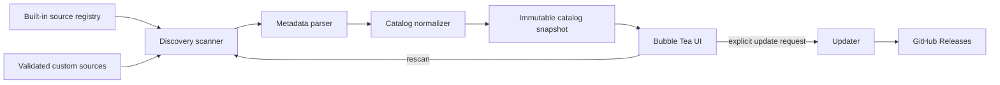

# skillbrowse Product Requirements and Design

**Date:** August 12, 2026  
**Status:** Approved design  
**Target release:** 1.0  
**Platforms:** macOS and Linux  
**Companion:** [Project brief](../../skillbrowse-project-brief.md)

## 1. Product definition

`skillbrowse` is a read-only terminal application that discovers AI-agent skills installed on the local machine, normalizes their metadata into a single catalog, and lets the user search and read each skill's `SKILL.md`. The executable also supports an explicit, secure self-upgrade flow.

The application must remain useful when directories are missing, permissions are mixed, metadata is incomplete, names collide, or one skill is malformed.

### 1.1 Problem statement

Agent skills are distributed across tool-specific directories and plugin caches. There is no consistent local inventory, and directory layout alone does not provide a readable summary. Users need a single, fast view of what is installed, where it lives, which agent locations expose it, and what its instructions say.

### 1.2 Goals

- Discover supported local skill installations without manual setup.
- Accept custom sources without requiring code changes.
- Provide enough metadata to distinguish and understand catalog entries.
- Make navigation, fuzzy search, and Markdown reading fast and keyboard-native.
- Degrade gracefully around individual filesystem and content errors.
- Keep ordinary browsing private, local, and read-only.
- Let users upgrade the application through a verified release channel.

### 1.3 Non-goals for 1.0

- Installing, modifying, deleting, enabling, disabling, or upgrading skills.
- Judging whether a skill's instructions are safe or high quality.
- Proving semantic compatibility with an agent; agent labels describe discovery locations.
- Searching online catalogs or synchronizing between machines.
- Persistent indexing, a daemon, or filesystem watching.
- Telemetry or automatic update checks.
- A Windows build.

## 2. Users and jobs

### 2.1 Primary persona

A developer using multiple AI coding agents who has skills installed through personal directories, symlinks, and plugin-managed caches.

### 2.2 Jobs to be done

- “Show me all skills available on this machine.”
- “Find the skill related to a task even if I do not remember its exact name.”
- “Tell me which path and agent installation exposed this skill.”
- “Let me read the complete instructions without changing applications.”
- “Explain why a skill or source could not be parsed.”
- “Tell me whether a newer `skillbrowse` exists and install it safely when I ask.”

## 3. User experience

### 3.1 Startup

Running `skillbrowse` opens an alternate-screen TUI. The frame appears immediately with a scanning indicator; catalog entries may stream in as source scans complete. The current filter and stable selection are preserved when a manual rescan replaces the catalog.

No network request occurs on startup.

### 3.2 Wide layout

At terminal widths of 100 columns or more, the application uses two panes:

- The left pane uses roughly one third of the width for the searchable skill list.
- The right pane shows metadata followed by a scrollable rendering of `SKILL.md`.
- A footer shows context-sensitive keys, skill count, source count, and warning count.

### 3.3 Narrow layout

Below 100 columns, the list and detail reader become separate screens. `Enter` opens the selected skill, `Esc` returns, and the list preserves its filter, selection, and scroll position. If the terminal is too small to present usable content, the app shows the minimum required dimensions instead of corrupting the layout.

### 3.4 List item content

Each item shows:

- Display name.
- One-line description when space permits.
- Agent labels.
- Shortened source path or a multiple-source count.
- A warning marker when diagnostics apply.

The default sort is case-insensitive display name, then canonical path. Search results are ranked by fuzzy-match score and retain deterministic path tie-breaking.

### 3.5 Detail content

The detail pane shows:

1. Name and description.
2. Agent labels and every contributing source path.
3. Canonical installation path and modification time.
4. Diagnostics, when present.
5. Rendered `SKILL.md` content.

`v` toggles to exact raw file content, including front matter. The renderer does not open hyperlinks or execute terminal control sequences contained in the file.

### 3.6 Key map

| Context | Keys | Result |
|---|---|---|
| Global | `q`, `ctrl+c` | Quit. |
| Global | `?` | Toggle help. |
| Global | `r` | Rescan local sources. |
| Global | `u` | Check for an application update and show an explicit confirmation before installation. |
| Catalog | `↑/↓`, `j/k` | Move selection. |
| Catalog | `/` | Focus fuzzy search. |
| Catalog | `Enter` | Focus details on wide screens or open details on narrow screens. |
| Search | `Esc` | Clear or leave search. |
| Detail | `↑/↓`, `j/k`, `pgup/pgdn` | Scroll content. |
| Detail | `v` | Toggle rendered and raw content. |
| Detail | `Esc` | Return focus to the catalog. |

## 4. Command-line surface

```text
skillbrowse [--config PATH] [--path PATH ...] [--no-defaults] [--no-color]
skillbrowse upgrade [--check] [--yes]
skillbrowse version
skillbrowse help
```

- The default command opens the TUI.
- Repeatable `--path` arguments add unlabeled custom sources for that run.
- `--no-defaults` scans only command-line and configured sources.
- `--no-color` disables ANSI styling while retaining structure.
- `upgrade --check` reports availability without changing the executable.
- `upgrade` asks for confirmation on an interactive terminal.
- `upgrade --yes` enables deliberate non-interactive use.
- `version` prints version, commit, build date, Go version, OS, and architecture.

Exit codes are `0` for success, including “already current”; `1` for operational failures; and `2` for invalid arguments or configuration. Partial scan warnings do not make an otherwise usable TUI exit unsuccessfully.

## 5. Discovery model

### 5.1 Built-in source registry

The initial registry contains these source families:

| Agent label | Source root | Scan behavior |
|---|---|---|
| Agent Skills | `~/.agents/skills` | Direct skill directories and explicit symlink targets. |
| Claude Code | `~/.claude/skills` | Direct skill directories and explicit symlink targets. |
| Claude Code | `~/.claude/plugins/cache` | Bounded recursive scan for plugin `skills` directories. |
| Cursor | `~/.cursor/skills` | Direct skill directories and explicit symlink targets. |
| Codex | `~/.codex/skills` | Direct skill directories and explicit symlink targets. |
| Codex | `~/.codex/plugins/cache` | Bounded recursive scan for plugin `skills` directories. |
| Hermes | `~/.hermes/skills` | Direct skill directories and explicit symlink targets. |

Missing built-in roots are normal and produce no user-facing warning. Existing but unreadable roots produce a source diagnostic.

The registry is isolated from the scanner so future layouts can be added with a source descriptor and fixtures rather than TUI changes.

### 5.2 Custom configuration

The default configuration file is `$XDG_CONFIG_HOME/skillbrowse/config.toml` when `XDG_CONFIG_HOME` is an absolute path, otherwise `~/.config/skillbrowse/config.toml` on both supported platforms.

Example:

```toml
version = 1

[[sources]]
path = "~/work/shared-agent-skills"
label = "Team skills"
agents = ["Claude Code", "Codex"]
max_depth = 4
enabled = true

[[sources]]
path = "/opt/company/skills"
label = "Company"
agents = ["Custom agent"]
max_depth = 6
enabled = true
```

Rules:

- `version` must equal `1`.
- Relative source paths are rejected; `~` is accepted only as the first path component and expands to the current user's home.
- `label` is optional and defaults to the final path component.
- `agents` is optional and defaults to `Custom`.
- `max_depth` defaults to `4` and must be between `1` and `12`.
- `enabled` defaults to `true`.
- A malformed configuration is a startup error with the file, field, and correction guidance.

### 5.3 Walking and candidate rules

- A skill candidate is a directory containing a regular file named exactly `SKILL.md`.
- Scans are bounded by the source's configured depth.
- `.git`, `node_modules`, and `vendor` directories are not traversed.
- The scanner resolves the source root if it is a symlink.
- It does not recursively follow arbitrary directory symlinks. A symlink whose immediate target contains `SKILL.md` is accepted as a skill candidate.
- Canonical path and filesystem identity tracking prevent cycles and repeated parsing.
- Work is concurrent across source roots and bounded by a small worker pool; cancellation stops outstanding reads when the user quits or starts a new rescan.
- `SKILL.md` files larger than 2 MiB remain listed with a diagnostic, but their content is not loaded or rendered.

### 5.4 Metadata extraction

The parser reads YAML front matter when present:

- `name` becomes the display name after whitespace normalization.
- `description` becomes the brief description after whitespace normalization.
- Unknown fields are preserved only in raw content and do not cause an error.

Fallbacks are deterministic:

- Missing or invalid `name` falls back to the containing directory name.
- Missing or invalid `description` falls back to the first meaningful Markdown paragraph, stripped of formatting and limited to 280 Unicode characters.
- If no paragraph exists, the description is `No description provided`.

An invalid front matter block creates a diagnostic and triggers both fallbacks where needed; it does not hide the skill.

### 5.5 Normalization and duplicates

A catalog record contains:

```text
Skill
  ID                  stable hash of canonical path
  Name                display name
  Description         one-line summary
  CanonicalPath       resolved skill directory
  SkillFilePath       canonical SKILL.md path
  ObservedPaths[]     every source-visible path
  Agents[]            union of source agent labels
  SourceLabels[]      union of source labels
  ModifiedAt          SKILL.md modification time
  Content             bounded raw Markdown
  Diagnostics[]       parse, access, or size warnings
```

- Candidates resolving to the same canonical directory merge into one record.
- Agent and source-label unions are sorted and unique.
- Same-named skills at different canonical paths remain separate.
- Agent labels indicate where the skill was discovered; the UI does not claim semantic compatibility.

## 6. Search behavior

- Search is case-insensitive and fuzzy.
- The searchable value concatenates name, description, agents, source labels, observed paths, and canonical path.
- Filtering starts after the first character and updates after each edit.
- Matching text is highlighted where the list component supports it.
- An empty query restores the deterministic default sort.
- If the selected item disappears, selection moves to the nearest remaining item; if no items remain, the detail pane shows a clear empty state.

## 7. Functional requirements

| ID | Requirement | Acceptance condition |
|---|---|---|
| FR-01 | Discover skills from every existing built-in source. | Fixture trees for all registry entries produce the expected catalog and attribution. |
| FR-02 | Load enabled custom sources and command-line paths. | Valid sources combine with defaults; `--no-defaults` excludes the registry. |
| FR-03 | Normalize metadata and duplicates. | Canonical duplicates merge; name collisions at separate paths do not. |
| FR-04 | Continue after item-level failures. | An unreadable or malformed skill yields a diagnostic while other entries remain usable. |
| FR-05 | Provide fuzzy search. | Name, description, agent, label, and path queries find the expected fixture entries. |
| FR-06 | Support wide and narrow terminal workflows. | Resizing across the 100-column boundary preserves query, selection, and scroll state. |
| FR-07 | Show complete skill details. | Metadata, all source paths, diagnostics, and the full bounded `SKILL.md` are accessible. |
| FR-08 | Render and expose raw Markdown. | `v` switches without losing scroll context when a corresponding location can be retained. |
| FR-09 | Rescan on demand. | `r` replaces the catalog, preserves stable selection when possible, and reports scan status. |
| FR-10 | Expose contextual help. | `?` lists all active bindings and does not discard application state. |
| FR-11 | Check for and install application updates explicitly. | TUI and command flows show current/latest versions, require consent unless `--yes`, and verify the release before replacement. |
| FR-12 | Report version and build metadata. | `skillbrowse version` returns all specified fields without launching the TUI. |

## 8. Architecture

### 8.1 Package boundaries

```text
cmd/skillbrowse       command routing, flags, dependency wiring
internal/config       TOML loading, validation, path expansion
internal/sources      built-in registry and source descriptors
internal/discovery    bounded filesystem scanning and cancellation
internal/skill        parser, normalized model, diagnostics
internal/catalog      merging, sorting, filtering inputs
internal/ui           Bubble Tea models, views, key maps, responsive layout
internal/markdown     sanitized rendering and width-aware cache
internal/update       release lookup, verification, staging, replacement
internal/buildinfo    version and build metadata
```

Each package exposes a small interface or immutable value model. Filesystem discovery has no dependency on terminal components. The updater has no dependency on the catalog. The UI receives catalog snapshots and diagnostics through messages rather than reading the filesystem directly.

### 8.2 Data flow



### 8.3 Technology baseline

- Go 1.26 is the initial build baseline.
- [Bubble Tea v2](https://github.com/charmbracelet/bubbletea) provides the Elm-style model, update, and view loop.
- [Bubbles v2](https://github.com/charmbracelet/bubbles) provides list, text input, viewport, spinner, and help components.
- [Lip Gloss v2](https://github.com/charmbracelet/lipgloss) provides terminal-capability-aware styling and layout.
- [Glamour v2](https://github.com/charmbracelet/glamour) renders Markdown with width-aware wrapping.
- Standard-library primitives handle walking, hashing, Ed25519 verification, downloads, archives, and atomic filesystem operations.
- Dependency versions are pinned by `go.mod` and updated deliberately through reviewed pull requests.

## 9. Error handling and diagnostics

Errors fall into three classes:

1. **Fatal startup errors:** invalid command syntax, invalid configuration, or inability to determine a home directory when required. The program prints a concise correction and exits with code `2` for syntax/configuration or `1` for the environment.
2. **Source diagnostics:** an explicitly configured root is missing or unreadable. Scanning continues; the footer shows the warning count and the help/diagnostics view provides path and cause.
3. **Skill diagnostics:** content is too large, unreadable, or contains invalid front matter. The record remains visible when its directory can be identified.

Missing built-in roots are silent. Diagnostics must avoid dumping stack traces by default, must never include file content, and must use home-relative paths in the UI where possible. A `SKILLBROWSE_DEBUG=1` environment variable enables structured diagnostic details on stderr for development without writing a log file.

## 10. Performance and reliability

| ID | Requirement | Target |
|---|---|---|
| NFR-01 | Initial responsiveness | Render the frame or scan indicator within 100 ms at p95. |
| NFR-02 | Catalog readiness | Make a 1,000-skill local SSD fixture usable within 500 ms at p95 on a 2022-era laptop. |
| NFR-03 | Interaction latency | Navigation, focus changes, and filtering render within 50 ms at p95. |
| NFR-04 | Memory | Stay below 100 MiB for 10,000 skills whose loaded Markdown totals no more than 50 MiB. |
| NFR-05 | Resilience | A failure in one source or skill never aborts other source scans. |
| NFR-06 | Determinism | The same fixture, configuration, and terminal size produce the same catalog order and semantic view. |
| NFR-07 | Cancellation | Quit and rescan cancel obsolete work without goroutine leaks. |

Benchmarks use committed synthetic fixture generators and record Go version, OS, architecture, filesystem type, and terminal dimensions.

## 11. Privacy and security

- Catalog scanning and Markdown rendering are local-only.
- The application performs no automatic update check and includes no telemetry.
- Skill files are treated as untrusted text. They are never executed, sourced, evaluated as templates, or allowed to inject terminal control sequences.
- Rendered output strips unsafe control characters while retaining tabs and newlines needed for readable Markdown.
- Links are rendered as text; the application does not open them in 1.0.
- Scan depth, ignored directories, symlink rules, read-size limits, and cancellation bound filesystem work.
- Error output never includes skill contents.
- The updater accepts HTTPS release URLs only and never passes downloaded values to a shell.

## 12. Application upgrade design

### 12.1 User flow

- `skillbrowse upgrade --check` or `u` fetches the latest stable release metadata.
- If the current version is equal to or newer than the release, the UI reports that it is current.
- If an update exists, the UI shows current version, target version, release URL, and download size.
- Installation requires confirmation unless the command includes `--yes`.
- No prerelease is selected for a stable installed version.

### 12.2 Release lookup

The updater calls GitHub's public `GET /repos/{owner}/{repo}/releases/latest` endpoint with an explicit API version and a bounded timeout. The repository identity is compiled into official binaries. The response must match strict asset naming for the current OS and architecture.

### 12.3 Verification and replacement

Each release contains:

- Platform archives.
- A SHA-256 checksum manifest.
- An Ed25519 signature over the exact checksum-manifest bytes.
- Build provenance and an SBOM produced by the release workflow.

Official binaries embed the trusted Ed25519 public key and a key identifier. The updater:

1. Downloads release metadata, the selected archive, checksum manifest, and signature to bounded temporary files.
2. Verifies the manifest signature with the embedded key.
3. Verifies the archive's SHA-256 digest against the signed manifest.
4. Extracts only the expected executable, rejecting absolute paths, `..`, symlinks, extra executable candidates, and oversized entries.
5. Confirms the staged binary reports the expected target version.
6. Creates the staging file in the executable's directory, preserves executable permissions, flushes it, and atomically renames it over the current path.

Every check occurs before replacement. A failure leaves the current executable untouched and returns recovery guidance. A non-writable installation reports the resolved executable path and suggests reinstalling through the installation method used; it does not escalate privileges.

Key rotation uses a release signed by both the old and new keys. The corresponding application release embeds both public keys; a later release may retire the old key.

### 12.4 Release tooling

[GoReleaser](https://goreleaser.com/getting-started/intro/) builds and publishes archives and SHA-256 checksums. The release workflow signs the checksum file, creates provenance, and runs clean-machine launch tests before publishing the GitHub Release. Application verification is implemented in-process so users do not need `cosign`, `gh`, or another external executable.

## 13. Accessibility and terminal compatibility

- All workflows are keyboard-accessible.
- Selection is indicated by both shape/text and color.
- Light, dark, 256-color, 16-color, and no-color terminals retain readable hierarchy.
- Layout width is measured in terminal cells, including wide Unicode characters.
- `NO_COLOR` and `--no-color` are honored.
- Reduced terminal dimensions produce a clear fallback message.
- The application supports UTF-8 locales; unsupported byte sequences are replaced safely for display while raw file bytes remain unchanged on disk.

## 14. Testing strategy

### 14.1 Unit tests

- Configuration parsing, defaults, validation, and expansion.
- Source descriptors and built-in registry paths.
- Scan depth, ignored directories, symlink candidates, cancellation, and permission failures.
- Front matter parsing, fallbacks, Unicode truncation, and size limits.
- Canonical deduplication, agent unions, deterministic ordering, and stable IDs.
- Version comparison, asset selection, signature verification, checksum parsing, and archive safety.

### 14.2 Golden and property tests

- Golden terminal views for wide, narrow, empty, warning, search, help, light, dark, and no-color states.
- Golden rendered Markdown covering headings, code blocks, tables, lists, and malformed input.
- Property tests for path normalization, deduplication idempotence, and archive path rejection.

### 14.3 Integration tests

- Temporary fixture trees representing every built-in source family.
- Duplicate skills reached by real paths and symlinks.
- Mixed valid, invalid, oversized, and unreadable skills.
- A local fake release server covering no-update, successful-update, timeout, corrupt archive, bad checksum, bad signature, wrong asset, non-writable target, and interrupted download cases.

### 14.4 End-to-end and release tests

- Pseudo-terminal tests drive navigation, search, resize, detail focus, raw toggle, rescan, help, and quit.
- CI runs tests and race detection on macOS and Linux.
- Release candidates are installed into clean temporary locations for `amd64` and `arm64`, then launch, version, update-check, and checksum smoke tests run.
- A rollback invariant test proves that every updater failure before rename leaves the original executable byte-for-byte unchanged.

## 15. Delivery and release requirements

- GitHub Actions runs formatting, static analysis, tests, race tests, vulnerability checks, and cross-platform builds.
- GoReleaser publishes macOS and Linux archives for `amd64` and `arm64`.
- Release artifacts use semantic versions and immutable Git tags.
- The initial distribution channels are direct GitHub Release downloads and a documented install script that performs the same signature and checksum checks as the in-app updater.
- A Homebrew formula may be published, but it is not a prerequisite for 1.0 and does not replace the built-in updater requirement.
- Release notes explicitly identify source-registry additions and changes to discovery behavior.

## 16. Definition of done for 1.0

Version 1.0 is ready when:

- FR-01 through FR-12 pass automated acceptance tests.
- NFR-01 through NFR-07 pass on documented reference environments.
- All built-in source layouts have committed positive, missing-root, malformed-content, and symlink fixtures.
- The TUI is usable in wide, narrow, color, and no-color terminal profiles.
- Ordinary startup and rescan are verified to make zero network requests.
- Signed release verification rejects modified manifests and artifacts.
- Interrupted or failed upgrades leave the original executable usable.
- macOS and Linux `amd64` and `arm64` archives pass clean-install smoke tests.
- User documentation covers configuration, keys, diagnostics, privacy, upgrading, and uninstalling.

## 17. Risks and mitigations

| Risk | Impact | Mitigation |
|---|---|---|
| Agent layouts evolve independently | Skills become invisible or mislabeled. | Isolated source registry, fixture tests, custom sources, and release-note visibility. |
| Recursive plugin caches are unexpectedly large | Slow launch or excessive I/O. | Narrow registry roots, bounded depth, ignored directories, worker limits, cancellation, and benchmarks. |
| Canonical paths collapse meaningful installations | Attribution becomes confusing. | Preserve all observed paths, labels, and agents on the merged record. |
| Terminal escape content produces unsafe output | Display manipulation or misleading UI. | Sanitize untrusted control characters before rendering and test hostile fixtures. |
| Release channel or artifact is tampered with | Compromised application update. | Embedded-key signature verification, signed checksum manifest, strict assets, HTTPS, and no shell execution. |
| The executable directory is not writable | Built-in upgrade cannot complete. | Preflight permissions and return installation-specific recovery guidance without privilege escalation. |

## 18. Approved product decisions

- Name: `skillbrowse`.
- Platforms: macOS and Linux.
- Discovery: built-in sources plus configurable custom paths.
- Navigation: arrow/vi keys plus fuzzy search.
- Architecture: modular, in-memory Go application.
- UI: responsive split pane using Bubble Tea and companion Charm libraries.
- Upgrade scope: application self-upgrades only.
- Network policy: explicit updater actions only.
- Data policy: no telemetry and no persistent skill-content cache.

## 19. Primary references

- [Bubble Tea](https://github.com/charmbracelet/bubbletea)
- [Bubbles](https://github.com/charmbracelet/bubbles)
- [Lip Gloss](https://github.com/charmbracelet/lipgloss)
- [Glamour](https://github.com/charmbracelet/glamour)
- [GitHub REST API: releases](https://docs.github.com/en/rest/releases/releases#get-the-latest-release)
- [GoReleaser introduction](https://goreleaser.com/getting-started/intro/)
- [GoReleaser checksums](https://goreleaser.com/customization/package/checksum/)
- [GoReleaser signing](https://goreleaser.com/customization/sign/sign/)
